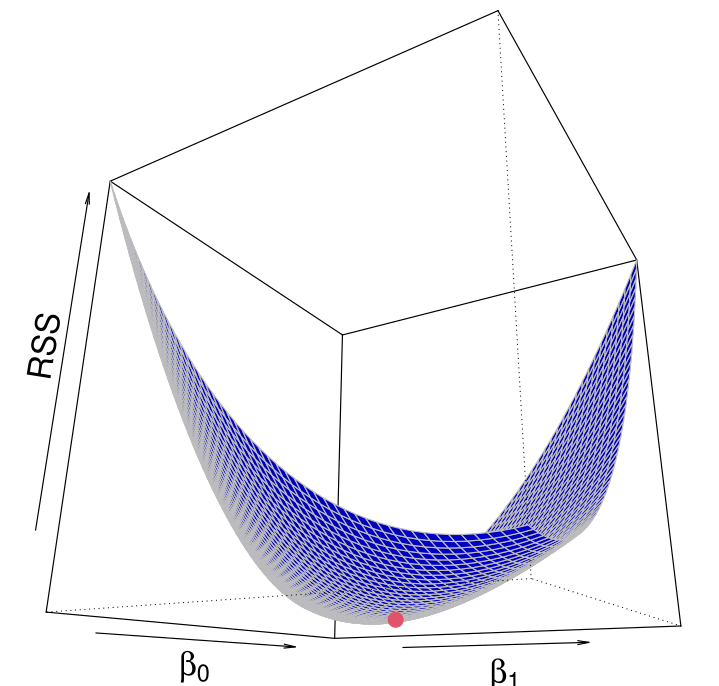
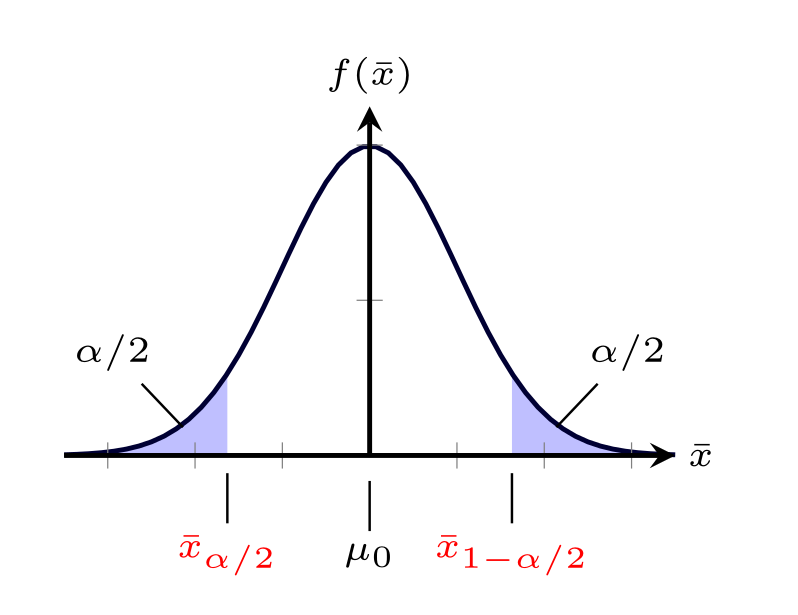

 
 

{width=40%}

 
 

Salam Everyone! Welcome to the course webpage of ECO 204 (Faculty - STH). This course is an introduction to statistical inference. Broadly the discipline of Statistics falls in two categories: Descriptive Statistics and Inferential Statistics. In this course we will focus on the latter. 

The key idea here would be to conclude something about a population based on a sample. We will cover the following topics in this course:

1. Point and Interval Estimation of Mean and Proportion (one sample and two sample problems)
2. Hypothesis Testing of Mean and Proportion (one sample and two sample problems)
3. Simple and Multiple Linear Regression Model, Estimation and Testing.
4. Basic Time Series Analysis
5. Goodness of fit test and some non-parametric tests (e.g., sign test and rank test), if time permits!
6. Analysis of Variance Technique

 
 

{width=50%}

You will get the course outline in PDF soon.... 

 

  © ECO 204 Summer 2025. All rights reserved. |Site Maintained by - Shaikh Tanvir Hossain and Habiba Afroz

