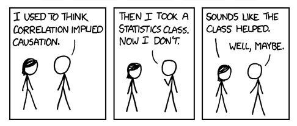

 
 

{width=40%}

 
 

Salam Everyone! We created this website for the Causality Reading Group at [East West University, Bangladesh](https://www.ewubd.edu/). We are a group of researchers and students at the Economics department interested in causal inference and its applications in various fields. Our goal is to learn, and share knowledge related to causal inference.

Currently the plan is to read and discuss some papers on causal inference. The group is ideally open to anyone who is interested in learning about causal inference, regardless of their background or level of expertise. The only **condition as a member is that you have to read a paper for every session and then present the key ideas in front of the group members.** 

If you are interested to join the group then please send an email at <a name="tanvir">tanvir.hossain@ewubd.edu</a>. Also if you are in the group, then you should already have access to the Google Drive Folder, here is the  [link](https://drive.google.com/drive/folders/132IX6Tlz3p04S6dmRt8ZiysCKrJBNEh8?usp=sharing)

 
 

{width=70%}

 

